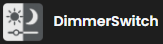
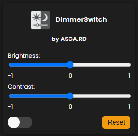

# DimmerSwitch

DimmerSwitch is a browser extension that allows you to control the brightness and contrast of any website, enhancing your browsing experience.

## Overview

It's perfect for watching movies, browsing at night, or simply making things easier on your eyes. With DimmerSwitch, you can quickly adjust the visual settings of any webpage to suit your preferences.

## Features

- **Brightness Slider**: Easily adjust the brightness of any site.
- **Contrast Slider**: Fine-tune the contrast to improve visibility.
- **User-Friendly Interface**: Simple and intuitive design for easy navigation.
- **No Ads or Tracking**: Enjoy a clean experience without interruptions.

## Why DimmerSwitch?

Sometimes the web can be overwhelmingly bright, especially in low-light conditions. DimmerSwitch provides a quick and effective way to dim the screen without altering your device's display settings. It's designed to enhance your comfort while browsing.

## Status

- **Current Version**: 1.0
- **Development Status**: Work in progress! We are continuously working on improving the extension and adding new features.

## Team

- Guilherme Andrade [@adr-g](https://github.com/adr-g)
- André Silva [@andresilva669](https://github.com/andresilva669)

> ## License
>
> This project is licensed under the GNU Affero General Public License v3.0 (AGPL-3.0).
>
> You are free to use, copy, modify, and distribute this software, provided that:
> - Any modifications or derivative works are also licensed under the AGPL v3.0.
> - If you make the software available over a network, the source code must also be made available to users.
>
> See the [LICENSE](LICENSE) file for the full license text or visit:  
> [https://www.gnu.org/licenses/agpl-3.0.html](https://www.gnu.org/licenses/agpl-3.0.html)

